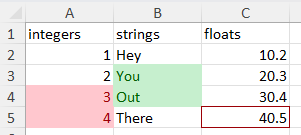
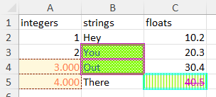
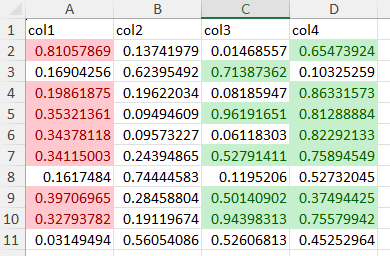
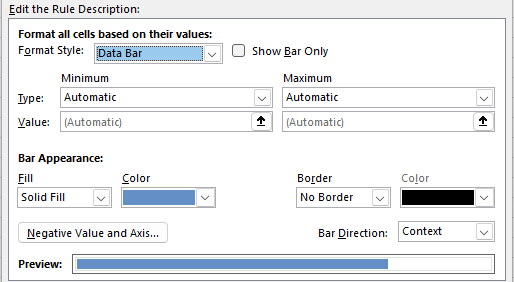
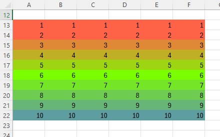
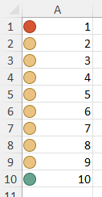
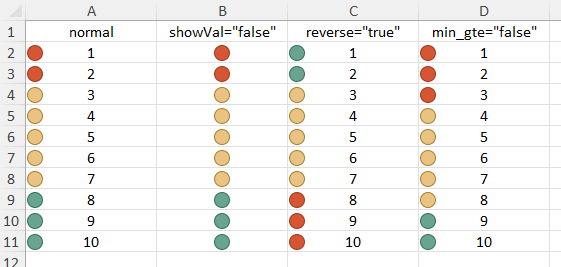
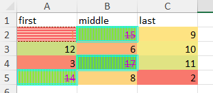
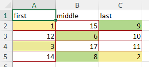
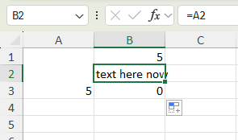

# Formatting Guide

## Excel Formatting

Each cell in an Excel spreadsheet may refer to an Excel `style`. Multiple cells can 
refer to the same `style` and therefore have a uniform appearance. A `style` defines
the cell's `alignment` directly (as part of the `style` definition), but it may also 
refer to further formatting definitions for `font`, `fill`, `border`, `format`. 
Multiple `style`s may each refer to the same `fill` definition or the same `font` 
definition, etc, and therefore share these formatting characteristics.
This hierarchy can be shown like this:
```
                `Cell`
                  │
               `Style` => `Alignment`
                  │
  ┌──────────┬────┴─────┬─────────┐
  │          │          │         │
`font`     `fill`    `border`  `format`
```
A family of setter functions is provided to set each of the formatting characteristics 
Excel uses. These are applied to cells, and the functions deal with the relationships 
between the individual characteristics, the overarching `style` and the cell(s) themselves.

## Setting format attributes of a cell

Set the font attributes of a cell using [`XLSX.setFont`](@ref). For example, to set cells `A1` and 
`A5` in the `general` sheet of a workbook to specific `font` values, use:

```julia

julia> using XLSX

julia> f=XLSX.opentemplate("general.xlsx")
XLSXFile("general.xlsx") containing 13 Worksheets
            sheetname size          range        
-------------------------------------------------
              general 10x6          A1:F10       
               table3 5x6           A2:F6        
               table4 4x3           E12:G15
                table 12x8          A2:H13
               table2 5x3           A1:C5
                empty 1x1           A1:A1
               table5 6x1           C3:C8
               table6 8x2           B1:C8
               table7 7x2           B2:C8
               lookup 4x9           B2:J5
         header_error 3x4           B2:E4
       named_ranges_2 4x5           A1:E4
         named_ranges 14x6          A2:F15

julia> s=f["general"]
10×6 XLSX.Worksheet: ["general"](A1:F10)

julia> XLSX.setFont(s, "A1"; name="Arial", size=24, color="blue", bold=true)
2

julia> XLSX.setFont(s, "A5"; name="Arial", size=24, color="blue", bold=true)
2
```

The function returns the `fontId` that has been used to define this combination 
of attributes.

There are more `font` attributes that can be set. Setting attributes for a cell 
that already has some, merges the new attributes with the old. Thus:

```julia
julia> XLSX.setFont(s, "A5"; italic=true, under="double", bold=false)
3
```

will over-ride the `bold` setting that was previously defined and add a double 
underline and make the font italic. However, the color, font name and size will 
all remain unchanged from before. This new combination of attributes is unique, 
so a new `fontId` has been created.

Font colors (and colors in any of the other formatting functions) can be set using a 
hex RGB value or by name using any of the colors provided by [Colors.jl](https://juliagraphics.github.io/Colors.jl/stable/namedcolors/)

The other set attribute functions behave in similar ways. See [`XLSX.setBorder`](@ref), 
[`XLSX.setFill`](@ref), [`XLSX.setFormat`](@ref) and [`XLSX.setAlignment`](@ref).

## Formatting multiple cells at once

### Applying `setAttribute` to multiple cells

Each of the setter functions can be applied to multiple cells at once using cell-ranges, 
row- or column-ranges or non-contiguous ranges. Additionally, indexing can use integer
indices for rows and columns, vectors of index values, unit- or step-ranges. This makes 
it easy to apply formatting to many cells at once.

Thus, for example:

```julia

julia> using XLSX

julia> f=XLSX.newxlsx()
XLSXFile("C:\...\blank.xlsx") containing 1 Worksheet
            sheetname size          range        
-------------------------------------------------
               Sheet1 1x1           A1:A1

julia> s=f[1]
1×1 XLSX.Worksheet: ["Sheet1"](A1:A1)

julia> s[1:100, 1:100] = "" # Ensure these aren't `EmptyCell`s.
""

julia> XLSX.setFont(s, "A1:CV100"; name="Arial", size=24, color="blue", bold=true)
-1                          # Returns -1 on a range.

julia> XLSX.setBorder(s, "A1:CV100"; allsides = ["style" => "thin", "color" => "black"])
-1

julia> XLSX.setAlignment(s, [10, 50, 90], 1:100; wrapText=true) # Wrap text in the specified rows.
-1

julia>  XLSX.setAlignment(s, 1:100, 2:2:100; rotation=90) # Rotate text 90° every second column in the first 100 rows.
-1
```

It is even possible to use defined names to index these functions:

```julia

julia> XLSX.addDefinedName(s, "my_name", "A1,B20,C30") # Define a non-contiguous named range.
XLSX.DefinedNameValue(Sheet1!A1,Sheet1!B20,Sheet1!C30, Bool[1, 1, 1])

julia> XLSX.setFill(s, "my_name"; pattern="solid", fgColor="coral")
-1
```

When setting format attributes over a range of cells as decribed, the new attributes are merged 
with existing on a cell by cell basis. If you set the font name on a range of cells that previously 
all had different font colors, the color differences will persist even as the font name is applied 
to the range consistently.

### Setting uniform attributes

Sometimes it is useful to be able to apply a fully consistent set of format attributes to a range of 
cells, over-riding any pre-existing differences. This is the purpose of the `setUniformAttribute` 
family of functions. These functions update the attributes of the first cell in the range and then 
apply the relevant attribute Id to the rest of the cells in the range. Thus:

```julia
julia> XLSX.setUniformBorder(s, "A1:CV100"; allsides = ["color" => "green"], diagonal = ["direction"=>"both", "color"=>"red"])
2 # This is the `borderId` that has now been uniformly applied to every cell.
```

This sets the border color in cell `A1` to be green and adds red diagonal lines across the cell. 
It then applies all the `Border` attributes of cell `A1` uniformly to all the other cells in the range, 
overriding their previous attributes.

All the format setter functions have `setUniformAttribute` versions, too. See [`XLSX.setUniformBorder`](@ref), 
[`XLSX.setUniformFill`](@ref), [`XLSX.setUniformFormat`](@ref) and [`XLSX.setUniformAlignment`](@ref).

### Setting uniform styles

It is possible to use each of these functions in turn to ensure every possible attribute is consistently 
applied to a range of cells. However, if perfect uniformity is required, then `setUniformStyle` is 
considerably more efficient. It will simply take the `styleId` of the first cell in the range and apply 
it uniformly to each cell in the range. This ensures that all of font, fill, border, format, and 
alignment are all completely consistent across the range:

```julia
julia> XLSX.setUniformStyle(s, "A1:CV100") # set all formatting attributes to be uniformly tha same as cell A1.
7    # this is the `styleId` that has now been applied to all cells in the range
```

### Illustrating the different approaches

To illustrate the differences between applying `setAttribute`, `setUniformAttribute` and `setUinformStyle`,
consider the following worksheet, which has very hetrogeneous formatting across the three cells:


We can apply `setBorder()` to add a top border to each cell:

```julia
julia> XLSX.setBorder(s, "B2,D2,F2"; top=["style"=>"thick", "color"=>"red"])
-1
```
This merges the new top border definition with the other, existing attributes, to get


Alternatively, we can apply `setUniformBorder()`, which will update the borders of cell `B2` 
and then apply all the border formatting to the other cells, overwriting the previous settings:

```julia
julia> XLSX.setUniformBorder(s, "B2,D2,F2"; top=["style"=>"thick", "color"=>"red"])
4
```

This makes the border formatting entirely consistent across the cells but leaves the other formatting 
attributes as they were.


Finally, we can set `B2` to have the formatting we want, and then apply a uniform style to all three cells.

```julia
julia> XLSX.setBorder(s, "B2"; top=["style"=>"thick", "color"=>"red"])
4

julia> XLSX.setUniformStyle(s, "B2,D2,F2")
19
```
Which results in all formatting attributes being entirely consistent across the cells.


### Performance differences between methods

To illustrtate the relative performance of these three methods, applied to a million cells:
```julia
using XLSX
function setup()
    f = XLSX.newxlsx()
    s = f[1]
    s[1:1000, 1:1000] = pi
    return f
end
do_format(f) = XLSX.setFormat(f[1], 1:1000, 1:1000; format="0.0000")
do_uniform_format(f) = XLSX.setUniformFormat(f[1], 1:1000, 1:1000; format="0.0000")
function do_format_styles(f)
    XLSX.setFormat(f[1], "A1"; format="0.0000")
    XLSX.setUniformStyle(f[1], 1:1000, 1:1000)
end
function timeit()
    f = setup()
    do_format(f)
    do_uniform_format(f)
    do_format_styles(f)
    f = setup()
    print("Using `setFormat`        : ")
    @time do_format(f)
    f = setup()
    print("Using `setUniformFormat` : ")
    @time do_uniform_format(f)
    f = setup()
    print("Using `setUniformStyles` : ")
    @time do_format_styles(f)
    return f
end
f=timeit()
```

which yields the following timings:

```
Using `setFormat`        :  39.925697 seconds (1.04 G allocations: 71.940 GiB, 19.13% gc time)
Using `setUniformFormat` :  27.875646 seconds (711.00 M allocations: 48.195 GiB, 18.46% gc time)
Using `setUniformStyles` :   0.589316 seconds (14.00 M allocations: 416.628 MiB, 16.98% gc time)
```

The same test, using the more involved `setBorder` function

```julia
do_format(f) = XLSX.setBorder(f[1], 1:1000, 1:1000;
        left     = ["style" => "dotted", "color" => "FF000FF0"],
        right    = ["style" => "medium", "color" => "firebrick2"],
        top      = ["style" => "thick",  "color" => "FF230000"],
        bottom   = ["style" => "medium", "color" => "goldenrod3"],
        diagonal = ["style" => "dotted", "color" => "FF00D4D4", "direction" => "both"]
    )
```

gives

```
Using `setBorder`        :  96.824494 seconds (2.82 G allocations: 194.342 GiB, 18.82% gc time)
Using `setUniformBorder` :  32.182135 seconds (787.00 M allocations: 62.081 GiB, 20.85% gc time)
Using `setUniformStyles` :   0.606058 seconds (14.00 M allocations: 416.660 MiB, 16.19% gc time)
```
If maintaining heterogeneous formatting attributes is not important, it is much more efficient to 
apply `setUinformAttribute` functions rather than `setAttribute` functions, especially on large 
cell ranges, and more efficient still to use `setUniformStyle`.

## Copying formatting attributes

It is possible to use non-contiguous ranges to copy format attributes from any cell to any other cells, 
whether you are also updating the source cell's format or not.

```julia
julia> XLSX.setBorder(s, "BB50"; allsides = ["style" => "medium", "color" => "yellow"])
3 # Cell BB50 now has the border format I want!

julia> XLSX.setUniformBorder(s, "BB50,A1:CV100") # Make cell BB50 the first (reference) cell in a non-contiguous range.
3

julia> XLSX.setUniformStyle(s, "BB50,A1:CV100") # Or if I want to apply all formatting attributes from BB50 to the range.
11
```

## Setting column width and row height

Two functions offer the ability to set the column width and row height within a worksheet. These can use 
all of the indexing options described above. For example:

```julia
julia> XLSX.setRowHeight(s, "A2:A5"; height=25)  # Rows 1 to 5 (columns ignored)

julia> XLSX.setColumnWidth(s, 5:5:100; width=50) # Every 5th column.
```

Excel applies some padding to user specified widths and heights. The two functions described here attempt 
to do something similar but it is not an exact match to what Excel does. User specified row heights and 
column widths will therefore differ by a small amount from the values you would see setting the same 
widths in Excel itself.

## Applying conditional formats

In Excel, a conditional format is a format that is applied if the content of a cell meets some criterion 
but not otherwise. Such conditional formatting is generally straightforward to apply using the 
`setAttribute()` functions or the `setConditionalFormat()` function described here.

!!! note

    In Excel, conditional formats are dynamic. If the cell values change, the formats are updated based 
    on application of the condition to the new values.

    The examples of conditional formatting given here a mix of static and dynamic formats.
    
    Static conditional formats apply formatting based on the current cell values at the time the format 
    is set, but the formats are then static regardless of updates to cell values. They can be updated 
    by re-running the conditional formatting functions described but otherwise remain unchanged. Static 
    formats are created by applying the `setAttribute()` functions described above.

    Dynamic conditional formatting, using the native Excel conditional format functionality, is possible 
    using the `setConditionalFormat()` function, giving access to many of Excel's options (but not yet 
    all of them). 

### Static conditional formats

As an example, a function to set true values in a range to use a bold green font color and false values to use a bold 
red color a could be defined as follows:

```julia
function trueorfalse(sheet, rng) # Use green or red font for true or false respectively
    for c in rng
        if !ismissing(sheet[c]) && sheet[c] isa Bool
            XLSX.setFont(sheet, c, bold=true, color = sheet[c] ? "FF548235" : "FFC00000")
        end
    end
end
```

Applying this function over any range will conditionally color cells green or red if they are 
true or false respectively:

```julia
trueorfalse(sheet, XLSX.CellRange("E3:L6"))
```

Similarly, a function can be defined to fill any cells containing missing values to be filled with a grey 
color and have diagonal borders applied:

```julia
function blankmissing(sheet, rng) # Fill with grey and apply both diagonal borders on cells
    for c in rng                  # with missing values
        if ismissing(sheet[c])
            XLSX.setFill(sheet, c; pattern = "solid", fgColor = "lightgrey")
            XLSX.setBorder(sheet, c; diagonal = ["style" => "thin", "color" => "black"])
           end
    end
end
```

This can then be applied to a range of cells to conditionally apply the format:

```julia
blankmissing(sheet, XLSX.CellRange("B3:L6"))
```

### Dynamic conditional formats

XLSX.jl provides a function to create native Excel conditional formats that will be saved 
as part of an `XLSXFile` and which will update dynamically if the values in the cell range 
to which the formatting is applied are subsequently updated.

`XLSX.setConditionalFormat(sheet, CellRange, :type; kwargs...)`

Excel uses a range of `:type` values to describe these conditional formats and the same values 
are used here, as follows:
- `:cellIs`
- `:top10`
- `:aboveAverage`
- `:containsText`
- `:notContainsText`
- `:beginsWith`
- `:endsWith`
- `:timePeriod`
- `:containsErrors`
- `:notContainsErrors`
- `:containsBlanks`
- `:notContainsBlanks`
- `:uniqueValues`
- `:duplicateValues`
- `:expression`
- `:dataBar`
- `:colorScale`
- `:iconSet`

Use of these different `:type`s is illustrated in the following sections.
For more details on the range of `:type` values and their associated keyword 
options, refer to [XLSX.setConditionalFormat()](@ref).

#### Cell Value

It is possible to format each cell in a range when the cell's value meets a specified condition using one 
of a number of built-in cell format options or using custom formatting. This group of formatting options 
represents the greatest range of conditional formatting options available in Excel and the most often 
used. All the functions of `Highlight Cells Rules` and `Top/Bottom Rules` are provided.

  

The following `:type` values are used to set conditional formats by making direct comparisons to a cell's value:
- `:cellIs`
- `:top10`
- `:aboveAverage`
- `:containsText`
- `:notContainsText`
- `:beginsWith`
- `:endsWith`
- `:timePeriod`
- `:containsErrors`
- `:notContainsErrors`
- `:containsBlanks`
- `:notContainsBlanks`
- `:uniqueValues`
- `:duplicateValues`

Each of these formatting types needs a set of keyword options to fully define its operation. 
For example, the `:cellIs` type needs an `operator` keyword, set to define the test to make 
to determine whether or not to apply the formatting. Valid `operator` values are:

- `greaterThan`     (cell >  `value`)
- `greaterEqual`    (cell >= `value`)
- `lessThan`        (cell <  `value`)
- `lessEqual`       (cell <= `value`)
- `equal`           (cell == `value`)
- `notEqual`        (cell != `value`)
- `between`         (cell between `value` and `value2`)
- `notBetween`      (cell not between `value` and `value2`)

Each of these need the keyword `value` to be specified and, for `between` and `notBetween`, `value2` 
must also be specified.

All the cell value formatting types can use one of six built-in formats in Excel as illustrated here 
for the `greaterThan` comparison.


These six built-in formatting options are available by name in XLSX.jl by specifying the `dxStyle` 
keyword with one of the following values:
* `redfilltext`
* `yellowfilltext`
* `greenfilltext`
* `redfill` 
* `redtext`
* `redborder`

Thus, for example, to create a simple `XLSXFile` from scratch and then apply some 
conditional formats to its cells:

```julia
julia> columns = [ [1, 2, 3, 4], ["Hey", "You", "Out", "There"], [10.2, 20.3, 30.4, 40.5] ]
3-element Vector{Vector}:
 [1, 2, 3, 4]
 ["Hey", "You", "Out", "There"]
 [10.2, 20.3, 30.4, 40.5]

julia> colnames = [ "integers", "strings", "floats" ]
3-element Vector{String}:
 "integers"
 "strings"
 "floats"

julia> f=XLSX.newxlsx()
XLSXFile("C:\...\blank.xlsx") containing 1 Worksheet
            sheetname size          range        
-------------------------------------------------
               Sheet1 1x1           A1:A1

julia> s=f[1]
1×1 XLSX.Worksheet: ["Sheet1"](A1:A1) 

julia> XLSX.writetable!(s, columns, colnames)

julia> s[1:5, 1:3]
5×3 Matrix{Any}:
  "integers"  "strings"    "floats"
 1            "Hey"      10.2
 2            "You"      20.3
 3            "Out"      30.4
 4            "There"    40.5

julia> XLSX.setConditionalFormat(s, "A2:A5", :cellIs;       # Cells with a value > 2 to have red text and light red fill.
                    operator="greaterThan",
                    value="2",
                    dxStyle="redfilltext")
0

julia> XLSX.setConditionalFormat(s, "B2:B5", :containsText; # Cells with text containing "u" to have green text and light green fill.
                    value="u",
                    dxStyle="greenfilltext")
0

julia> XLSX.setConditionalFormat(s, "C2:C5", :top10;        # Cells with values in the top 10% of values in the range to have a red border.
                    operator ="topN%",
                    value="10"
                    dxStyle="redborder")
0

```



Alternatively, it is possible to specify custom format options to match the options offered in Excel 
under the `Custom Format...` option:


!!! note

    In the image above, the font name and size selectors are greyed out.  Excel limits 
    the formatting attributes that can be set in a conditional format. It is not 
    possible to set the size or name of a font and neither is it possible to set any 
    of the cell alignment attributes. Diagonal borders cannot be set either.

    Although it is not a limitation of Excel, for simplicity this function sets all the 
    border attributes for each side of a cell to be the same.

For example, starting with the same simple `XLSXFile` as above, we can apply the following custom formats:

```julia
julia> XLSX.setConditionalFormat(s, "A2:A5", :cellIs;
                   operator="greaterThan",
                   value="2",
                   font=["color" => "coral", "bold"=>"true"],
                   fill=["pattern"=>"solid", "bgColor"=>"cornsilk"],
                   border=["style"=>"dashed", "color"=>"orangered4"],
                   format=["format"=>"0.000"])
0

julia> XLSX.setConditionalFormat(s, "B2:B5", :containsText;
                    value="u",
                    font=["color" => "steelblue4", "italic"=>"true"],
                    fill=["pattern"=>"darkTrellis", "fgColor"=>"lawngreen", "bgColor"=>"cornsilk"],
                    border=["style"=>"double", "color"=>"magenta3"])
0

julia> XLSX.setConditionalFormat(s, "C2:C5", :top10;
                    operator ="topN%",
                    value="10",
                    font=["color" => "magenta3", "strike"=>"true"],
                    fill=["pattern"=>"lightVertical", "fgColor"=>"lawngreen", "bgColor"=>"cornsilk"],
                    border=["style"=>"double", "color"=>"cyan"])
0

julia> XLSX.getConditionalFormats(s)
3-element Vector{Pair{XLSX.CellRange, NamedTuple}}:
 C2:C5 => (type = "top10", priority = 3)
 B2:B5 => (type = "containsText", priority = 2)
 A2:A5 => (type = "cellIs", priority = 1)

```



The `formatting_type` needed for these different functions varies, as do the keyword options.
Refer to [XLSX.setConditionalFormat()](@ref) for full details.

#### Expressions

It is possible to use an Excel formula directly to determine whether to apply a conditional format. 
Any expression that evaluates to true or false can be used.


For example, to compare one column with another and apply a conditional format accordingly:

```julia
julia> f=XLSX.newxlsx()
XLSXFile("C:\...\blank.xlsx") containing 1 Worksheet
            sheetname size          range        
-------------------------------------------------
               Sheet1 1x1           A1:A1        

julia> s=f[1]
1×1 XLSX.Worksheet: ["Sheet1"](A1:A1) 

julia> XLSX.writetable!(s, [rand(10), rand(10), rand(10), rand(10)], ["col1", "col2", "col3", "col4"])

julia> s[:]
11×4 Matrix{Any}:
  "col1"     "col2"     "col3"     "col4"
 0.810579   0.13742    0.0146856  0.654739
 0.169043   0.623955   0.713874   0.103253
 0.198619   0.19622    0.0818595  0.863316
 0.353214   0.0949461  0.961917   0.812889
 0.343781   0.0957323  0.061183   0.822921
 0.34115    0.243949   0.527914   0.758945
 0.161748   0.744446   0.119521   0.52732
 0.39707    0.284588   0.501409   0.374944
 0.327938   0.191197   0.943983   0.755799
 0.0314949  0.560541   0.526068   0.45253

julia> XLSX.setConditionalFormat(s, "A2:A10", :expression; formula = "A2>B2", dxStyle = "redfilltext")
0

julia> XLSX.setConditionalFormat(s, "C2:D10", :expression; formula = "C2>\$B2", dxStyle = "greenfilltext")
0
```


Column A uses relative referencing. Columns C and D use an absolute reference for the column but not the row.

The following example uses absolute references on rows and compares the average of each column with the 
average of the preceding column.

```julia
julia> f=XLSX.newxlsx()
XLSXFile("C:\...\blank.xlsx") containing 1 Worksheet
            sheetname size          range
-------------------------------------------------
               Sheet1 1x1           A1:A1

julia> s=f[1]
1×1 XLSX.Worksheet: ["Sheet1"](A1:A1)

julia> XLSX.writetable!(s, [rand(10).*1000, rand(10).*1000, rand(10).*1000, rand(10).*1000], ["2022", "2023", "2024", "2025"])

julia> XLSX.setConditionalFormat(s, "B2:D11", :expression; formula = "average(B\$2:B\$11) > average(A\$2:A\$11)", dxStyle = "greenfilltext")
0

julia> XLSX.setConditionalFormat(s, "B2:D11", :expression; formula = "average(B\$2:B\$11) < average(A\$2:A\$11)", dxStyle = "redfilltext")
0
```


(Row 13 above is the average of each column, calculated in Excel)

When a formula uses relative references, the relative position of the reference to the base cell in the range to which 
the condition is applied is used consistently throughout the range.
This is illustrated in the following example:

```julia
julia> f=XLSX.newxlsx()
XLSXFile("C:\...\blank.xlsx") containing 1 Worksheet
            sheetname size          range
-------------------------------------------------
               Sheet1 1x1           A1:A1

julia> s=f[1]
1×1 XLSX.Worksheet: ["Sheet1"](A1:A1) 

julia> for i=1:10; for j=1:10; s[i, j] = i*j; end; end

julia> XLSX.setConditionalFormat(s, "A1:E5", :expression; formula = "E5 < 50", dxStyle = "redfilltext")
0
```


The format applied in cell `A1` is determined by comparison of cell `E5` to the value 50. In `B2` it is 
based on cell `F6`, in `C3`, on cell `G7` and so on throughtout the range.

Text based comparisons in Excel are not case sensitive by default, but can be forced to be so:

```julia
julia> f=XLSX.newxlsx()
XLSXFile("C:\...\blank.xlsx") containing 1 Worksheet
            sheetname size          range
-------------------------------------------------
               Sheet1 1x1           A1:A1

julia> s=f[1]
1×1 XLSX.Worksheet: ["Sheet1"](A1:A1)

julia> s[1:3,1:3]="HELLO WORLD"
"HELLO WORLD"

julia> s["A1"] = "Hello World"
"Hello World"

julia> s["B2"] = "Hello World"
"Hello World"

julia> s["C3"] = "Hello World"
"Hello World"

julia> XLSX.setConditionalFormat(s, "A1:A3", :expression; formula = "A1=\"hello world\"", dxStyle = "redfilltext")
0

julia> XLSX.setConditionalFormat(s, "B1:B3", :expression; formula = "B1=\"HELLO WORLD\"", dxStyle = "redfilltext")
0

julia> XLSX.setConditionalFormat(s, "C1:C3", :expression; formula = "exact(\"Hello World\", C1)", dxStyle = "greenfilltext")
0
```


#### Data Bar

(In development)




#### Color Scale

It is possible to apply a `:colorScale` formatting type to a range of cells.
In Excel there are twelve built-in color scales available, but it is possible to create 
custom color scales, too.


In XLSX.jl, the twelve built-in scales are named by their end/mid/start colors as follows 
(layout follows image)

|                  |                  |                 |                 |
|:----------------:|:----------------:|:---------------:|:---------------:|
|  greenyellowred  |  redyellowgreen  |  greenwhitered  |  redwhitegreen  |
|   bluewhitered   |   redwhiteblue   |    whitered     |    redwhite     |
|    greenwhite    |    whitegreen    |   greenyellow   |   yellowgreen   |

The default colorscale is `greenyellow`. To use a different built-in color scale, 
specify the name using the keyword `colorscale`, thus:

```julia
julia> XLSX.setConditionalFormat(f["Sheet1"], "A1:F12", :colorScale) # Defaults to the `greenyellow` built-in scale.
0

julia> XLSX.setConditionalFormat(f["Sheet1"], "A13:C18", :colorScale; colorscale="whitered")
0

julia> XLSX.setConditionalFormat(f["Sheet1"], "D13:F18", :colorScale; colorscale="bluewhitered")
0
```

A custom color scale may be defined by the colors at each end of the scale and (optionally) by some 
mid-point color, too. Colors can be specified using hex RGB values or by name using any of the colors
in [Colors.jl](https://juliagraphics.github.io/Colors.jl/stable/namedcolors/).

In Excel, the colorScale options (for a 3 color scale) look like this:


The end points (and optional mid-point) can be defined using an absolute number (`num`), a `percent`, 
a `percentile` or as a `min` or `max`. For the first three options, a value must also be given.
The value may be taken from a cell by setting `min_val`, `mid_val` or `max_val` to a cell reference.
Thus, you can apply a custom 3-color scale using, for example:

```julia
julia> XLSX.setConditionalFormat(f["Sheet1"], "A13:F22", :colorScale;
            min_type="num", 
            min_val="2",
            min_col="tomato",
            mid_type="num",
            mid_val="6", 
            mid_col="lawngreen",
            max_type="num",
            max_val="10",
            max_col="cadetblue"
        )
0
```


#### Icon Set

It is possible to apply an `:iconSet` formatting type to a range of cells.
In Excel there are twenty built-in icon sets available, but it is possible to 
create a custom icon set from the 52 built-in icons, too.


In XLSX.jl, the twenty built-in icon sets are named as follows 
(layout follows image)

|                |                |                 |
|:--------------:|:--------------:|:---------------:|
| Directional    |    3Arrows     |  3ArrowsGray    |
|                |   3Triangles   |  4ArrowsGray    |
|                |    4Arrows     |  5ArrowsGray    |
|                |    5Arrows     |                 |
| Shapes         | 3TrafficLights | 3TrafficLights2 |
|                |    3Signs      | 4TrafficLights  |
|                |  4BlackToRed   |                 |
| Indicators     |   3Symbols     |   3Symbols2     | 
|                |    3Flags      |                 |
| Ratings        |    3Stars      |   4Ratings      |
|                |   5Quarters    |   5Ratings      |
|                |    5Boxes      |                 |

Choose one of these icon sets by name using the `iconset` keyword. If no `iconset` 
is specified, `3TrafficLights` is the default choice. For example

```julia
julia> f=XLSX.newxlsx()
XLSXFile("C:\...\blank.xlsx") containing 1 Worksheet
            sheetname size          range        
-------------------------------------------------
               Sheet1 1x1           A1:A1        

julia> s=f[1]
1×1 XLSX.Worksheet: ["Sheet1"](A1:A1) 

julia> s[1:10, 1]=1:10
1:10

julia> s[1:10, 1]=collect(1:10)
10-element Vector{Int64}:
  1
  2
  3
  4
  5
  6
  7
  8
  9
 10

julia> XLSX.setConditionalFormat(s, "A1:A10", :iconSet)
0
```


All of the options to control an iconSet in Excel are available. The iconSet options 
(for a 4-icon set) look like this:


Each icon set includes a default set of thresholds defining which symbol to use. These 
relate the cell value to the range of values in the cell range to which the conditional 
format is being applied. This can be illustrated (for a 4-icon set) as follows:

```
  Range     ┌────────────────┬─────────────────┬─────────────────┬────────────────┐   Range
  Minimum ->│     Icon 1     │     Icon 2      │     Icon 3      │     Icon 4     │<- Maximum
                         `min_val`         `mid_val`         `max_val`
                         threshold         threshold         threshold
``` 
The starting value for the first icon is always the minimum value of the range, and the stoping
value for the last icon is always the maximum value in the range. No cells will have values for 
which an icon cannot be assigned. The internal thresholds for transition from one icon to the 
next are defined (in a 3-icon set) by `min_val` and `max_val`. In a 4-icon set, an additional 
threshold, `mid-val` is required and in a 5-icon set, `mid2_val` is needed as well.

The type of these thresholds can be defined in terms of `percent` (of the range), `percentile` 
or simply with a `num` (number) (e.g. as `min_type="percent"`). For each threshold, 
the value can either be given as a number (as a String) or as a simple cell reference. 
Alternatively, specifying the type as `formula` allows the value to be determined by valid Excel 
formula.

!!! note

    Cell references used to define threshold values in an iconSet MUST always be given as absolute 
    cell references (e.g. `"\$A\$4"`). Relative references should not be used (but are not checked).

Using the example above, change both the type and value of the thresholds like this:

```julia
julia> XLSX.setConditionalFormat(s, "A1:A10", :iconSet; min_type="num", max_type="num", min_val="2", max_val="9")
0
```


To suppress the values in cells and just show the icons, use `showVal="false"`, to reverse the icon ordering 
use `reverse="true"` and to change the default comparison from `>=` to `>` set `min_gte="false"` (and 
equivalent for mid, mid2 and max):
```julia
julia> XLSX.writetable!(s, [collect(1:10), collect(1:10), collect(1:10), collect(1:10)],
                           ["normal", "showVal=\"false\"", "reverse=\"true\"", "min_gte=\"false\""]
                           )

julia> XLSX.setConditionalFormat(s, "A2:A11", :iconSet;
            min_type="num",  max_type="num",
            min_val="3",     max_val="8")
0

julia> XLSX.setConditionalFormat(s, "B2:B11", :iconSet;
            min_type="num",  max_type="num",
            min_val="3",     max_val="8",
            showVal="false")
0

julia> XLSX.setConditionalFormat(s, "C2:C11", :iconSet;
            min_type="num",  max_type="num",
            min_val="3",     max_val="8",
            reverse="true")
0

julia> XLSX.setConditionalFormat(s, "D2:D11", :iconSet;
            min_type="num",  max_type="num",
            min_val="3",     max_val="8",
            min_gte="false", max_gte="false")
0
```



Create a custom icon set by specifying `iconset="Custom"`. The icons to use in the custom set are 
defined with `icon_list` keyword, which takes a vector of integers definingwhich of the 52 built 
in icons to use. Use of the val and type keywords dictate the number of icons to use. If mid_type 
and mid_val are both defined, but not mid2_val and mid2_type, then a 4-icon will be used. If both 
sets are defined, a 5-icon set is used and if neither, a 3-icon set.

This is illustrated with code below, which produces a key defining which integer to use 
in `icon_list` to represent any desired icon:
```julia
using XLSX
f=XLSX.newxlsx()
s=f[1]
for i = 0:3
    for j=1:13
        s[i+1,j]=i*13+j
    end
end
for j=1:13
     XLSX.setConditionalFormat(s, 1:4, j, :iconSet; # Create a custom 4-icon set in each column.
        iconset="Custom",
        icon_list=[j, 13+j, 26+j, 39+j],
        min_type="percent", mid_type="percent", max_type="percent",
        min_val="25", mid_val="50", max_val="75"
        )
end
XLSX.setColumnWidth(s, 1:13, width=6.4)
XLSX.setRowHeight(s, 1:4, height=27.75)
XLSX.setAlignment(s, "A1:M4", horizontal="center", vertical="center")
XLSX.setBorder(s, "A1:M4", allsides = ["style"=>"thin","color"=>"black"])
XLSX.writexlsx("iconKey.xlsx", f, overwrite=true)
```


Specifying too few icons throws an error, any extra will simply be ignored.

#### Specifying cell references in Conditional Formats

##### Cell Ranges

Cell ranges for conditional formats always use absolute refences. The specified range to which a 
conditional format is to be applied is always converted to use absolute cell references so that, 
for example
```julia
julia> XLSX.setConditionalFormat(s, "A2:C5", :colorScale; colorscale="greenyellow")
```
will be converted automatically to the range "\$A\$2:\$C\$5". There is therefore no need to specify 
an absolute cell range when calling `setCondtionalFormat()`

##### Relative and absolute cell references

Cell references used to specify `value` or `value2` or in any `formula` may be either absolute 
or relative and both can be very useful. it is important to understand which reference style you 
need and to specify accordingly. As in Excel, an absolute reference is defined using a `$` prefix 
to either or both the row or the column part of the cell reference but here the `$` must be 
appropriately escaped. Thus:
```
value = "B2"          # relative reference
value = "\$B\$2"      # (escaped) absolute reference
```
The cell used in a comparison is adjusted for each cell in the range if a relative reference is used. This is 
illustrated in the following example. Cells in column A are referenced to column B using a relative reference,
meaning `A2` is compared with `B2` but `A3` is compared with `B3` and so on until `A5` is compared with `B5`.
In contrast, column B is referenced to cell `C2` using an absolute reference. Each cell in column B is compared 
with cell `C2`.

```julia
julia> f=XLSX.newxlsx()
XLSXFile("C:\...\blank.xlsx") containing 1 Worksheet
            sheetname size          range
-------------------------------------------------
               Sheet1 1x1           A1:A1

julia> s=f[1]
1×1 XLSX.Worksheet: ["Sheet1"](A1:A1)

julia> col1=rand(5)
5-element Vector{Float64}:
 0.6283728884101448
 0.7516580026008692
 0.2738854683970795
 0.13517788102005834
 0.4659468387663539

julia> col2=rand(5)
5-element Vector{Float64}:
 0.7582186445697804
 0.739539172599636
 0.4389109821689414
 0.14156225872248773
 0.10715394525726485

julia> XLSX.writetable!(s, [col1, col2],["col1", "col2"])

julia> s["C2"]=0.5
0.5

julia> s[:]
6×3 Matrix{Any}:
  "col1"    "col2"    missing
 0.628373  0.758219  0.5
 0.751658  0.739539   missing
 0.273885  0.438911   missing
 0.135178  0.141562   missing
 0.465947  0.107154   missing

julia> XLSX.setConditionalFormat(s, "A2:A6", :cellIs; operator="greaterThan", value="B2", dxStyle="redfilltext")
0

julia> XLSX.setConditionalFormat(s, "B2:B6", :cellIs; operator="greaterThan", value="\$C\$2", dxStyle="greenfilltext")
0

```


!!! note

    Excel permits cell references to cells in other sheets for comparisons in conditional formats
    (e.g. "OtherSheet!A1"), but this is handled differently internally than references within the 
    same sheet. This functionality is not implemented in XLSX.jl yet. 

#### Overlaying conditional formats

It is possible to overlay multiple conditional formats over each other in a 
cell range or even in different, overlapping cell ranges. Starting with a table of 
integers, we can apply three different conditional formats sequentially. Excel applies 
these in priority order (priority 1 is higher priority than priority 2) which is the 
same as the order in which they were defined with `setConditionalFormat`.

```julia
julia> s[1:5, 1:3]
5×3 Matrix{Any}:
   "first"    "middle"    "last"
  1         15           9
 12          6          10
  3         17          11
 14          8           2

julia> XLSX.setConditionalFormat(f["Sheet1"], "A2:C5", :colorScale; colorscale="greenyellowred")
0

julia> XLSX.setConditionalFormat(s, "A2:C5", :top10;
                    operator ="topN",
                    value="3",
                    font=["color"=>"magenta3", "strike"=>"true"],
                    fill=["pattern"=>"lightVertical", "fgColor"=>"lawngreen", "bgColor"=>"cornsilk"],
                    border=["style"=>"double", "color"=>"cyan"])
0

julia> XLSX.setConditionalFormat(s, "A2:A5", :cellIs;
                   operator="lessThan",
                   value="2",
                   font=["color"=>"coral", "bold"=>"true"],
                   fill=["pattern"=>"lightHorizontal", "fgColor"=>"cornsilk"],
                   border=["style"=>"dashed", "color"=>"orangered4"])
0

julia> XLSX.getConditionalFormats(s)
3-element Vector{Pair{XLSX.CellRange, NamedTuple}}:
 A2:A5 => (type = "cellIs", priority = 3)
 A2:C5 => (type = "colorScale", priority = 1)
 A2:C5 => (type = "top10", priority = 2)

```



When applying multiple overlayed formats, it is possible to make the formatting stop if any cell meets 
one of the conditions, so that lower proirity conditional formats are not applied to that cell. This is 
achieved with the `stopIfTrue` keyword. It is not possible to apply `stopIfTrue` to dataBars, colorScales or 
iconSets.

For example:

```julia
julia> s[1:5, 1:3]
5×3 Matrix{Any}:
   "first"    "middle"    "last"
  1         15           9
 12          6          10
  3         17          11
 14          8           2

julia> XLSX.setConditionalFormat(s, "A2:C5", :cellIs; # No further conditions will be evaluated if this condition is met.
                    operator ="greaterThan",
                    value="9",
                    stopIfTrue="true",
                    dxStyle = "redborder")
0

julia> XLSX.setConditionalFormat(s, "A2:C5", :top10;  # Won't apply if the max value in the range is > 9.
                    operator ="topN",
                    value="1",
                    dxStyle = "redfilltext")
0

julia> XLSX.setConditionalFormat(s, "A2:C5", :colorScale; colorscale="greenyellow") # Won't apply to any cell with a value > 9
0
```



Overlaying the same three conditional formats without setting the `stopIfTrue` option 
will result in the following, instead:


## Working with Merged Cells

Worksheets may contain merged cells. XLSX.jl provides functions to identify the merged cells in a worksheet, 
to determine if a cell is part of a merged range and to determine the value of a merged cell range from any 
cell in that range.

```julia

julia> using XLSX

julia> f=XLSX.opentemplate("customXml.xlsx")
XLSXFile("customXml.xlsx") containing 2 Worksheets
            sheetname size          range        
-------------------------------------------------
              Mock-up 116x11        A1:K116
     Document History 17x3          A1:C17

julia> XLSX.getMergedCells(f[1])
25-element Vector{XLSX.CellRange}:
 D49:H49
 D72:J72
 F94:J94
 F96:J96
 F84:J84
 F86:J86
 D62:J63
 D51:J53
 D55:J60
 D92:J92
 D82:J82
 D74:J74
 D67:J68
 D47:H47
 D9:H9
 D11:G11
 D12:G12
 D14:E14
 D16:E16
 D32:F32
 D38:J38
 D34:J34
 D18:E18
 D20:E20
 D13:G13

julia> XLSX.isMergedCell(f[1], "D13")
true

julia> XLSX.isMergedCell(f[1], "H13")
false

julia> XLSX.getMergedBaseCell(f[1], "E18") # E18 is a merged cell. The base cell in the merged range is D18.
(baseCell = D18, baseValue = "Here") # The base cell in the merged range is D18 and it's value is "Here".
```

It is also possible to create new merged cells:

```julia

julia> XLSX.isMergedCell(f[1], "F5")
false

julia> XLSX.isMergedCell(f[1], "J8")
false

julia> XLSX.mergeCells(s, "F5:J8")

julia> s["F5"] = pi
π = 3.1415926535897...

julia> XLSX.isMergedCell(f[1], "J8")
true

julia> XLSX.isMergedCell(f[1], "F5")
true

julia> XLSX.getMergedBaseCell(f[1], "J8")
(baseCell = F5, baseValue = 3.141592653589793)
```

It is not allowed to create new merged cells that overlap at all with any existing merged cells.

!!! warning

    It is possible to write into any merged cell using `XLSX.jl`, even those that are not the 
    base cell of the merged range. This is illustrated below:

    ```julia

    julia> using XLSX

    julia> f=XLSX.newxlsx()
    XLSXFile("C:\...\blank.xlsx") containing 1 Worksheet
                sheetname size          range        
    -------------------------------------------------
                Sheet1 1x1           A1:A1        


    julia> s=f[1]
    1×1 XLSX.Worksheet: ["Sheet1"](A1:A1) 

    julia> s["A1:A3"]=5
    5
    ```

    This produces the simple sheet shown.

    

    Merging the three cells `A1:A3` sets the cells `A2` and `A3` to missing just as Excel does.

    ```
    julia> s["A1"]
    5

    julia> s["A2"]
    5

    julia> s["A3"]
    5

    julia> XLSX.mergeCells(s, "A1:A3")
    0

    julia> s["A1"]
    5

    julia> s["A2"]
    missing

    julia> s["A3"]
    missing
    ```

    

    However, even after the merge, it is possible to explicitly write into the merged cells. 
    These written values will not be visible in Excel but can still be accessed by reference.

    ```
    julia> s["A2"]="text here now"
    "text here now"

    julia> s["A1"]
    5

    julia> s["A2"]
    "text here now"

    julia> s["A3"]
    missing

    julia> XLSX.getMergedBaseCell(s, "A2")
    (baseCell = A1, baseValue = 5)

    ```

    The cell `A2` remains merged, and this is how Excel displays it. The assigned cell value 
    won't be visible in Excel, but it can be referenced in a formula as shown here, where 
    cell `B2` references cell `A2` in its formula ("=A2"):

    
    
    Assigning values to cells in a merged range like this is prevented in Excel itself by the UI 
    although it is possible using VBA. There is currently no check to prevent this in `XLSX.jl`.
    See [#241](https://github.com/felipenoris/XLSX.jl/issues/241)

## Examples

### Applying formatting to an existing table

Consider a simple table, created from scratch, like this:

```julia
using XLSX
using Dates

# First create some data in an empty XLSXfile
xf = XLSX.newxlsx()
sheet = xf["Sheet1"]

col_names = ["Integers", "Strings", "Floats", "Booleans", "Dates", "Times", "DateTimes", "AbstractStrings", "Rational", "Irrationals", "MixedStringNothingMissing"]
data = Vector{Any}(undef, 11)
data[1] = [1, 2, missing, UInt8(4)]
data[2] = ["Hey", "You", "Out", "There"]
data[3] = [101.5, 102.5, missing, 104.5]
data[4] = [true, false, missing, true]
data[5] = [Date(2018, 2, 1), Date(2018, 3, 1), Date(2018, 5, 20), Date(2018, 6, 2)]
data[6] = [Dates.Time(19, 10), Dates.Time(19, 20), Dates.Time(19, 30), Dates.Time(0, 0)]
data[7] = [Dates.DateTime(2018, 5, 20, 19, 10), Dates.DateTime(2018, 5, 20, 19, 20), Dates.DateTime(2018, 5, 20, 19, 30), Dates.DateTime(2018, 5, 20, 19, 40)]
data[8] = SubString.(["Hey", "You", "Out", "There"], 1, 2)
data[9] = [1 // 2, 1 // 3, missing, 22 // 3]
data[10] = [pi, sqrt(2), missing, sqrt(5)]
data[11] = [nothing, "middle", missing, "rotated"]

XLSX.writetable!(
    sheet,
    data,
    col_names;
    anchor_cell=XLSX.CellRef("B2"),
    write_columnnames=true,
)

XLSX.writexlsx("mytable_unformatted.xlsx", xf, overwrite=true)
```

By default, this table will look like this in Excel:


We can apply some formatting choices to change the table's appearance:


This is achieved with the following code:

```julia
# Cell borders
XLSX.setUniformBorder(sheet, "B2:L6";
    top    = ["style" => "hair", "color" => "FF000000"],
    bottom = ["style" => "hair", "color" => "FF000000"],
    left   = ["style" => "thin", "color" => "FF000000"],
    right  = ["style" => "thin", "color" => "FF000000"]
)
XLSX.setBorder(sheet, "B2:L2"; bottom = ["style" => "medium", "color" => "FF000000"]) 
XLSX.setBorder(sheet, "B6:L6"; top = ["style" => "double", "color" => "FF000000"])
XLSX.setOutsideBorder(sheet, "B2:L6"; outside = ["style" => "thick", "color" => "FF000000"])

# Cell fill
XLSX.setFill(sheet, "B2:L2"; pattern = "solid", fgColor = "FF444444")

# Cell fonts
XLSX.setFont(sheet, "B2:L2"; bold=true, color = "FFFFFFFF")
XLSX.setFont(sheet, "B3:L6"; color = "FF444444")
XLSX.setFont(sheet, "C3"; name = "Times New Roman")
XLSX.setFont(sheet, "C6"; name = "Wingdings", color = "FF2F75B5")

# Cell alignment
XLSX.setAlignment(sheet, "L2"; wrapText = true)
XLSX.setAlignment(sheet, "I4"; horizontal="right")
XLSX.setAlignment(sheet, "I6"; horizontal="right")
XLSX.setAlignment(sheet, "C4"; indent=2)
XLSX.setAlignment(sheet, "F4"; vertical="top")
XLSX.setAlignment(sheet, "G4"; vertical="center")
XLSX.setAlignment(sheet, "L4"; horizontal="center", vertical="center")
XLSX.setAlignment(sheet, "G3:G6"; horizontal = "center")
XLSX.setAlignment(sheet, "H3:H6"; shrink = true)
XLSX.setAlignment(sheet, "L6"; horizontal = "center", rotation = 90, wrapText=true)

# Row height and column width
XLSX.setRowHeight(sheet, "B4"; height=50)
XLSX.setRowHeight(sheet, "B6"; height=15)
XLSX.setColumnWidth(sheet, "I"; width = 20.5)

# Conditional formatting
function blankmissing(sheet, rng) # Fill with grey and apply both diagonal borders on cells
    for c in rng                  # with missing values
        if ismissing(sheet[c])
            XLSX.setFill(sheet, c; pattern = "solid", fgColor = "grey")
            XLSX.setBorder(sheet, c; diagonal = ["style" => "thin", "color" => "black"])
           end
    end
end
function trueorfalse(sheet, rng) # Use green or red font for true or false respectively
    for c in rng
        if !ismissing(sheet[c]) && sheet[c] isa Bool
            XLSX.setFont(sheet, c, bold=true, color = sheet[c] ? "FF548235" : "FFC00000")
        end
    end
end
function redgreenminmax(sheet, rng) # Fill light green / light red the cell with maximum / minimum value
    mn, mx = extrema(x for x in sheet[rng] if !ismissing(x))
    for c in rng
        if !ismissing(sheet[c])
            if sheet[c] == mx
               XLSX.setFill(sheet, c; pattern = "solid", fgColor = "FFC6EFCE")
            elseif sheet[c] == mn
                XLSX.setFill(sheet, c; pattern = "solid", fgColor = "FFFFC7CE")
            end
        end
    end
end

blankmissing(sheet, XLSX.CellRange("B3:L6"))
trueorfalse(sheet, XLSX.CellRange("B2:L6"))
redgreenminmax(sheet, XLSX.CellRange("D3:D6"))
redgreenminmax(sheet, XLSX.CellRange("J3:J6"))
redgreenminmax(sheet, XLSX.CellRange("K3:K6"))

# Number formats
XLSX.setFormat(sheet, "J3"; format = "Percentage")
XLSX.setFormat(sheet, "J4"; format = "Currency")
XLSX.setFormat(sheet, "J6"; format = "Number")
XLSX.setFormat(sheet, "K3"; format = "0.0")
XLSX.setFormat(sheet, "K4"; format = "0.000")
XLSX.setFormat(sheet, "K6"; format = "0.0000")

# Save to an actual XLSX file
XLSX.writexlsx("mytable_formatted.xlsx", xf, overwrite=true)
```

### Creating a formatted form

There is a file, customXml.xlsx, in the \data folder of this project that looks like a template 
file - a form to be filled in. The code below creates this form from scratch and makes 
extensive use of vector indexing for rows and columns and of non-contiguous ranges:

```julia
using XLSX

f = XLSX.newxlsx()
s = f[1]
s["A1:K116"] = ""

s["B2"] = "Catalogue Entry Form"

s["B5"] = "User Data"
s["B7"] = "Recipient ID"
s["B9"] = "Recipient Name"
s["B11"] = "Address 1"
s["B12"] = "Address 2"
s["B13"] = "Address 3"
s["B14"] = "Town"
s["B16"] = "Postcode"
s["B18"] = "Ward"
s["B20"] = "Region"
s["H18"] = "Local Authority"
s["H20"] = "UK Constituency"
s["B22"] = "GrantID"
s["D22"] = "Grant Date"
s["F22"] = "Grant Amount"
s["H22"] = "Grant Title"
s["J22"] = "Distributor"
s["B32"] = "Distributor"

s["B30"] = "Creator"
s["B34"] = "Created by"
s["D36"] = "Email"
s["H36"] = "Phone"
s["B38"] = "Grant Manager"
s["D40"] = "Email"
s["H40"] = "Phone number"

s["B43"] = "Summary"
s["B45"] = "Summary ID"
s["H45"] = "Date Created"
s["B47"] = "Summary Name"
s["B49"] = "Headline"
s["B51"] = "Short Description"
s["B55"] = "Long Description"
s["B62"] = "Quote 1"
s["D65"] = "Quote Attribution"
s["H65"] = "Quote Date"
s["B67"] = "Quote 2"
s["D70"] = "Quote Attribution"
s["H70"] = "Quote Date"
s["B72"] = "Keywords"
s["B74"] = "Website"
s["B76"] = "Social media handles"
s["D76"] = "Twitter"
s["D78"] = "Facebook"
s["D80"] = "Instagram"
s["H76"] = "LinkedIn"
s["H78"] = "TikTok"
s["H80"] = "YouTube"
s["B82"] = "Image 1 filename"
s["D84"] = "Alt-Text"
s["D86"] = "Image Attribution"
s["D88"] = "Image Date"
s["D90"] = "Confirm permission to use image"
s["B92"] = "Image 2 filename"
s["D94"] = "Alt-Text"
s["D96"] = "Image Attribution"
s["D98"] = "Image Date"
s["D100"] = "Confirm permission to use image"

s["B103"] = "Penultimate category"
s["B105"] = "Competition Details"
s["D105"] = "Last year of entry"
s["D107"] = "Year of last win"
s["H105"] = "Categories of entry"
s["H107"] = "Categories of win"

s["B110"] = "Last category"
s["B112"] = "Use for Comms"
s["D112"] = "Comms Priority"
s["F112"] = "Comms End Date"

XLSX.setColumnWidth(s, 1:2:11; width=1.3)
XLSX.setColumnWidth(s, 2:2:10; width=18)
XLSX.setRowHeight(s, :; height=15)
XLSX.setRowHeight(s, [3, 4, 19, 28, 29, 35, 39, 41, 42, 64, 69, 77, 79, 83, 85, 87, 89, 93, 95, 97, 99, 101, 102, 106, 108, 109, 116]; height=5.5)
XLSX.setRowHeight(s, [5, 30, 43, 103, 110]; height=18)
XLSX.setRowHeight(s, 2; height=23)

XLSX.setFont(s, "B2"; size=18, bold=true)
XLSX.setUniformFont(s, [5, 30, 43, 103, 110], 2; size=14, bold=true)

XLSX.setUniformFill(s, [1, 2, 3, 4, 5, 6, 8, 10, 15, 17, 19, 21, 28, 29, 30, 31, 33, 35, 37, 39, 41, 42, 43, 44, 46, 48, 50, 52, 53, 54, 56, 57, 58, 59, 60, 61, 63, 64, 66, 68, 69, 71, 73, 75, 77, 79, 81, 83, 85, 87, 89, 91, 93, 95, 97, 99, 101, 102, 103, 104, 106, 108, 109, 110, 111, 115, 116], :; pattern="solid", fgColor="lightgrey")
XLSX.setUniformFill(s, :, [1, 3, 5, 7, 9, 11]; pattern="solid", fgColor="lightgrey")
XLSX.setFill(s, "F7,H7,J7,J9,H11:J16,F14,F16:F20,H32:J32,B36,B40,F45,J47:J49,B65,B70,B78:B80,B84:B90,B94:B100,H88:J90,H98:J100,B107,F114,H112:J115"; pattern="solid", fgColor="lightgrey")
XLSX.setFill(s, "D18,D20,J18,J20,D45"; pattern="solid", fgColor="darkgrey")
XLSX.setFill(s, "B112:B114,D112:D115"; pattern="solid", fgColor="white")
XLSX.setFill(s, "E90,E100,D115"; pattern="none")

XLSX.mergeCells(s, "D9:H9")
XLSX.mergeCells(s, "D11:G11,D12:G12,D13:G13")
XLSX.mergeCells(s, "D32:F32,D34:J34,D38:J38")
XLSX.mergeCells(s, "D47:H47,D49:H49")
XLSX.mergeCells(s, "D51:J53,D55:J60")
XLSX.mergeCells(s, "D62:J63,D67:J68")
XLSX.mergeCells(s, "D72:J72,D74:J74")
XLSX.mergeCells(s, "D82:J82,F84:J84,F86:J86")
XLSX.mergeCells(s, "D92:J92,F94:J94,F96:J96")

XLSX.setAlignment(s, "D51:J53,D55:J60,D62:J63,D67:J68"; vertical="top", wrapText=true)

XLSX.setBorder(s, "A1:K3"; outside = ["style" => "medium", "color" => "black"])
XLSX.setBorder(s, "A4:K28"; outside = ["style" => "medium", "color" => "black"])
XLSX.setBorder(s, "A29:K41"; outside = ["style" => "medium", "color" => "black"])
XLSX.setBorder(s, "A42:K101"; outside = ["style" => "medium", "color" => "black"])
XLSX.setBorder(s, "A102:K108"; outside = ["style" => "medium", "color" => "black"])
XLSX.setBorder(s, "A109:K116"; outside = ["style" => "medium", "color" => "black"])

XLSX.setBorder(s, "B7:D7,B9:H9"; allsides = ["style" => "thin", "color" => "black"])
XLSX.setBorder(s, "B11:G13,B14:D14,B16:D16"; allsides = ["style" => "thin", "color" => "black"])
XLSX.setBorder(s, "B18:D18,B20:D20,H18:J18,H20:J20"; allsides = ["style" => "thin", "color" => "black"])
XLSX.setUniformBorder(s, "B22:J27"; allsides = ["style" => "thin", "color" => "black"])

XLSX.setBorder(s, "B32:F32"; allsides = ["style" => "thin", "color" => "black"])
XLSX.setBorder(s, "B34:C34,D34:J34,D36:F36,H36:J36"; allsides = ["style" => "thin", "color" => "black"])
XLSX.setBorder(s, "B38:C38,D38:J38,D40:F40,H40:J40"; allsides = ["style" => "thin", "color" => "black"])
XLSX.setBorder(s, "D34:J36,D38:J40"; outside = ["style" => "thin", "color" => "black"])

XLSX.setBorder(s, "B45:D45,H45:J45"; allsides = ["style" => "thin", "color" => "black"])
XLSX.setBorder(s, "B47:H47,B49:H49"; allsides = ["style" => "thin", "color" => "black"])
XLSX.setBorder(s, "B51:C51,B55:C55"; allsides = ["style" => "thin", "color" => "black"])
XLSX.setBorder(s, "D51:J53,D55:J60"; outside = ["style" => "thin", "color" => "black"])

XLSX.setBorder(s, "B62:C62,D65:F65,H65:J65"; allsides = ["style" => "thin", "color" => "black"])
XLSX.setBorder(s, "B67:C67,D70:F70,H70:J70"; allsides = ["style" => "thin", "color" => "black"])
XLSX.setBorder(s, "D62:J63,D67:J68"; allsides = ["style" => "thin", "color" => "black"])
XLSX.setBorder(s, "D62:J65,D67:J70"; outside = ["style" => "thin", "color" => "black"])

XLSX.setBorder(s, "B72:J72,B74:J74"; allsides = ["style" => "thin", "color" => "black"])

XLSX.setBorder(s, "B76:F76,H76:J76,D78:F78,H78:J78,D80:F80,H80:J80"; allsides = ["style" => "thin", "color" => "black"])
XLSX.setBorder(s, "D76:J80"; outside = ["style" => "thin", "color" => "black"])

XLSX.setBorder(s, "B82:J82,D84:J84,D86:J86,D88:F88,D90:F90"; allsides = ["style" => "thin", "color" => "black"])
XLSX.setBorder(s, "D82:J90"; outside = ["style" => "thin", "color" => "black"])
XLSX.setBorder(s, "B92:J92,D94:J94,D96:J96,D98:F98,D100:F100"; allsides = ["style" => "thin", "color" => "black"])
XLSX.setBorder(s, "D92:J100"; outside = ["style" => "thin", "color" => "black"])

XLSX.setBorder(s, "B105:F105,H105:J105,D107:F107,H107:J107"; allsides = ["style" => "thin", "color" => "black"])
XLSX.setBorder(s, "D105:J107"; outside = ["style" => "thin", "color" => "black"])

XLSX.setBorder(s, "F112,F113"; allsides = ["style" => "thin", "color" => "black"])
XLSX.setBorder(s, "B112:B114,D112:D115"; outside = ["style" => "thin", "color" => "black"])

XLSX.writexlsx("myNewTemplate.xlsx", f, overwrite=true)
```